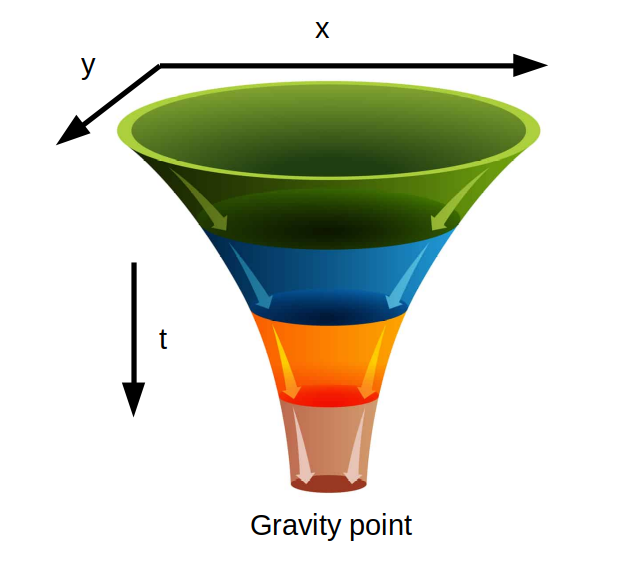
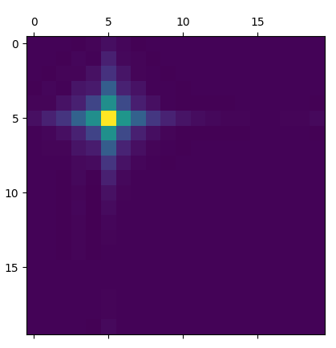
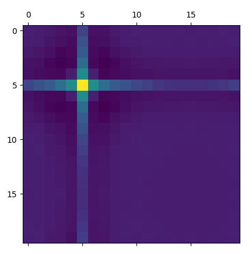
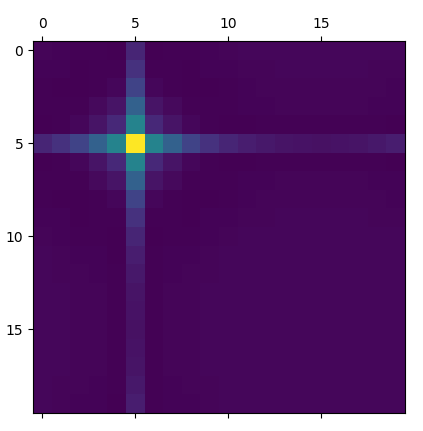
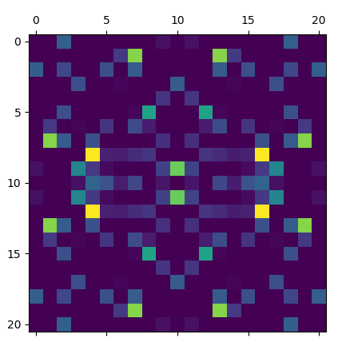
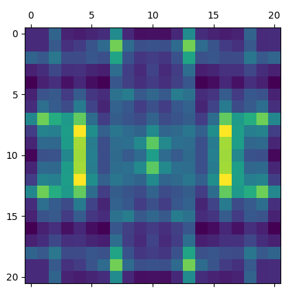

# Kore22 project
*By Julien Cardinal*

## Startup
Run the **main.ipynb** file that plays against the balanced agent. You can download the top agent of the beta version to have a more challenging opponent https://github.com/w9PcJLyb/kore-beta-bot. I wanted to thank him, it was a really good baseline to improve my code and get a sense of what should be done in the endgame.

All the code is in **main.py** and was made for the kaggle competition [Kore 2022](https://www.kaggle.com/competitions/kore-2022)

## Tests

In the **test_agent.ipynb** file, there are a lot of tests on customized maps to evaluate the agent in different situations. This is the laboratory to evaluate the different parameters fast enough.

# Cooperative A* 3d with gravity

The function astar3d finds the best plan *for a single shipyard* and the associated number of ships to send. It uses an heuristic function that depends on the gravity (used to pull the ships towards the high value kores and enemy fleets and shipyards) and the state of the current fleet.

## Generating the gravity
### Setting up the generators of the gravity
The principle is to put all important values in a 3 dimensions Space (size x size x number of predicted boards)
1. We first put the kore on each of the size x size shaped arrays that are modeling every boards at different timestamps. That way we get a list with the next ~30 kore maps.
2. We also put on it the enemy shipyard translated by a reward for taking them (depending on the max_spawn of the shipyard)
3. We finally take into account all the fleets at there position at each timestamp and put the reward for taking them on the list (depending on their kore and their ship_count) we also put a reward in the adjacent cells for attacking a fleet on its side

### The propagation of gravity
The idea is that the astar algorithm will only continue the routes where the heuristic has the best values. To attract the ship in a particular place, we need to artificially create a staircase of heuristic value increasing when we get closer to the high gravity points with the time increasing.

#### First attempt and ideas
We can think of doing some funnels with the gravity point at the bottom and maybe try a smoothing function in the x and y direction with t decreasing :



We could do that by applying a 3 x 3 filter, maybe something like this :
```python
filter = [[0,1,0],
	  [1,1,1],
	  [0,1,0]]
# with every value divided by a certain value so that it doesn't diverge
```
Here the center value is calculated on the board at the starting point (where we want the gravity value), the ones directly adjacent are calculated from the next board (at **t+1**) at the corresponding position in x and y (as if it were on the same board)

All the test were done in a separate file (filter_test.py) with matplotlib to visualize the gravity on each layer
This is a result for a rather even filter and one gravity center that stays that way on every steps :



#### The best filter
The idea is that the diagonals are not important to pull a ship toward an objective, the fleets travel more efficiently in straight lines (either on the **x** axis or on the **y** axis)
Also a fleet can easily detect a good center of gravity by passing by a perpendicular line and having the gravity in diagonal points can clog the gravity map, whereas focusing on the lines makes routes for the fleet appear.

The selection criteria for a filter depends on many factors :
1. The viability factors
- The divergence/the stability in x and y axis, it's the influence from one single center of gravity on far away points. A bad stability shows immediately, the far away points start to oscillate with important values
- The bias factor adding a value at each apply of the filter : it is shown by the difference, for a stable single center of gravity, between the value of the center at t=0 and the few lats ts. This factor can be approximated by an homothetic function that can be calculate with only one point for a fixed filter and then apply on the rest of the board (this way of doing is not that important with a low bias filter)

2. The utility factors
- The values in diagonal directions must stay as near to 0 as possible, usually they are negative due to the nature of the filter shape
- The values in the straight lines must be decreasing from the source with linear pace, I chose to get close to something like [v v/2 v/3 v/4 v/5]

The best 3x3 filter for the job was not very viable as the bias was too important and the diagonals were too impacted, here's the shape of it :



A 5x5 filter was necessary here and it was made so that we can have a maximum of zeros and reduce the temporal complexity.



With such a filter it makes the routes appears on the map :
<p float="left">
	
	
</p>

The filter :
```python
dimin = 1
c = -1.0 * dimin
l = -0.6 * dimin
d = 3.3 * dimin
e = 1.25 * dimin
ratio = 3.2/10

filter = [[0,l,e,l,0],
	  [l,c,d,c,l],
	  [e,d,0,d,e],
	  [l,c,d,c,l],
	  [0,l,e,l,0]]
```

## Generate the danger level
The danger level is a metric put on every cell, which states the minimum number of ships to go on a certain cell. The point for a fleet is to avoid dangerous cells, that are near an enemy shipyard, to avoid being easily taken by the enemy.

We put that in the space variable created (size x size x number of predicted boards).
-> From every enemy shipyard we put the corresponding danger level to all accessible cells (number of ships that can reach the cell), 

## Adding highways
Highways are not necessary for the algorithm to work well but they help reducing the number of cell visited : They are created at each shipyard in the four directions 
-> They only allow to detect the shipyards from further away

## The Pathfinding algorithm
### Coop A* 3d
For each shipyard we find the best move. There is no particular order, and maybe that can be upgraded. But for every shipyard we take into account the moves decided for the other (we refer to them as ghost_fleets), that's the part that is cooperative.
The best plan is found among a list of plans with a value for each of them.

We use the A* algorithm to find quickly the best routes. At every steps, the fleets choose the next cell for their paths according to the value giving to it : The value function is in fact the Heuristic of the pathfinding algorithm. Other values are taking into account to rule out certain path, judged too risky (danger_level), too long (if there is an incoming attack) or of no use (if it encounters an enemy shipyard/fleet that is too strong)

### The A* algorithm is really only about balance
The global result (for multiple steps) depends a lot on the utility of every ship launch. So we need to launch the best possible fleet for every situation. The problem is to converge quickly to the most useful paths.

The value function is there to give a value : how useful is a path. If it is negative, the path is seen as useless and we prefer spawning new ships instead. The point is to find the perfect behavior overall. Launching small fleets can be useful because they don't cost a lot to ship tho send but it also takes a turn during which we don't spawn a new fleet.

The exploration_cut is the limit value that a fleet is accepted, it forces the algorithm to find other paths 

Bonus_on_high is a bonus function that gives a boost on the first few cells for the fleets so that they explore a lot in the nearby cells to better find the global maximum (or a better local maximum)

This is all to make sure that we converge as quick as possible towards the best solution. That way we can actually manage capping the number of tiles visited to a small amount (maybe 100) and still have the best results. That will be very useful to improve time complexity.


# Time complexity

To submit the code, it was basically required to take less than 2s at every steps. It meant we had to improve the time complexity of every part of the code.
### Changes for board predict
The prediction of the next few boards take almost 1s at every step and there is nothing to do about it other than reprogram it completely...
To minimize this cost, we fixed the number of boards predicted to 30 (it was initially 40). That could be a little bit constraining if we ever want long routes for our ships

### Changes for gravity
The Gravity is the most time consuming function. To apply it, we chose to use a filter with more zeros and we also took apart the for loop that was doing inefficient calculations.
An other way to reduce the computing cost is to save a part of it in a variable for the next step and only compute the missing values. (This is the function I called Load_Gravity)

### Changes for Astar
Astar had to be capped in a certain way, otherwise it would never stop.
My first way of doing that was to only take into account when the ship arrive at a destination (the step of arriving there has to be the best step) but in doing so, there are many times when the agent get lost and retrieve 0 destination. I would cap the algorithm at a maximum of 5 destinations.
The upgrade is to store every possible destination(by not doing the final step of reaching there), which is a lot because of the highways. And then afterwards select the best one. With this method we always get a result(that can have a value below 0). And we cap the number of steps (cell visited) to be sure of the execution time. We observed that with the current setup, it was too costly to go beyond 2000 steps of the astar program, so we caped at 2000 steps in total, which makes sometimes only 100 when there are 20 shipyards. 

### Changes for Danger level
The danger level is the only function where the time cost increase with the number of shipyard. Which is a big problem in the endgame. We chose here to reduce the area of influence of enemy shipyard as the turn's number increase. From 10 cells to 6 if the enemy has more than 24 shipyards.

# To Conclude
This was a nice Competition and I had a lot of fun taking part ! I Hope you'll find some interesting ideas in my code ! (Don't forget to star the repo if you've made it this far, that would be much appreciated 🤗)
I had a lot of problems with the time complexity because it seemed impossible to reduce it to an acceptable value. I took a month off in the middle of the competition and I was able to do my first submission one week before the deadline. So I made some strategies for midgame and endgame in record time, those are not the best and surely need to be reworked.

For the result, I was happy to be in the top 100, with a submission with some random values for the heuristic. I am sure that the heuristic can be improved a lot as I didn't like to spend too much time to tweak the parameters.