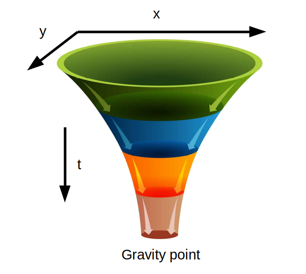
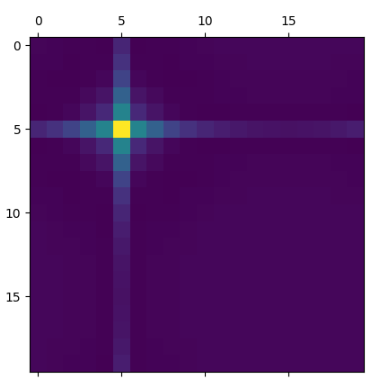

# Cooperative A* 3d with gravity

The function astar3d finds the best plan *for a single shipyard* and the associated number of ships to send. It uses an heuristic function that depends on the gravity (used to pull the ships towards the high value kores and enemy fleets and shipyards) and the state of the current fleet.

## Generating the gravity
### Setting up the generators of the gravity
The principle is to put all important values in a 3 dimensions Space (size x size x number of predicted boards)
1. We first put the kore on each of the size x size shaped arrays that are modelling every boards at different timestamps. That way we get a list with the next ~30 kore maps.
2. We also put on it the enemy shipyard translated by a reward for taking them (depending on the max_spawn of the shipyard)
3. We finally take into account all the fleets at there position at each timestamp and put the reward for taking them on the list (depending on their kore and their ship_count) we also put a reward in the adjacent cells for attacking a fleet on its side

### The propagation of gravity
The idea is that the astar algorithm will only continue the routes where the heuristic has the best values. To attract the ship in a particular place, we need to artificially create a staircase of heuristic value increasing when we get closer to the high gravity points with the time increasing.

#### First attempt and ideas
We can think of doing some funnels with the gravity point at the bottom and maybe try a smoothing function in the x and y direction with t decreasing :



We could do that by applying a 3 x 3 filter, mabe something like this :
```python
filter = [[0,1,0],
		  [1,1,1],
		  [0,1,0]]
# with every value divided by a certain value so that it doesn't diverge
```
Here the center value is calculated on the board at the starting point (where we want the gravity value), the ones directly adjacents are calculated from the next board (at **t+1**) at the corresponding position in x and y (as if it were on the same board)

All the test were done in a separate file (filter_test.py) with matplotlib to visualise the gravity on each layer
This is a result for a rather even filter and one gravity center that stays that way on every steps :


#### The best filter
The idea is that de diagonals are not important to pull a ship toward an objective, the fleets travel more efficiently in straight lines (either on the **x** absis or on the **y** absis)
Also a fleet can easily detect a good center of gravity by passing by a perpendicular line and having the gravity in diagonal points can clog the gravity map, whereas focusing on the lines makes routes for the fleet appear.

The selection criteria for a filter depends on many factors :
1. The viability factors
- The divergence/the stability in x and y axis, it's the influence from one single center of gravity on far away points. A bad stability shows immidiatly, the far away ponts start to oscillate with important values
- The bias factor adding a value at each apply of the filter : it is shown by the difference, for a stable single center of gravity, between the value of the center at t=0 and the few lats ts. This factor can be approximated by an homotethic function that can be calculate with only one point for a fixed filter and then apply on the rest of the board (this way of doing is not that important with a low bias filter)

2. The utility factors
- The values in diagonal directions must stay as near to 0 as possible, usually they are negative due to the nature of the filter shape
- The values in the straight lines must be decreasing from the source with linear pace, I chose to get close to something like [v v/2 v/3 v/4 v/5]

The best 3x3 filter for the job was not very viable as the biais was too important and the diagonals were too impacted, here's the shape of it :


A 5x5 filter was necessary here and it was made so that we can have a maximum of zeros and reduce the temporal complexity.


With such a filter it makes the routes appears on the map :


